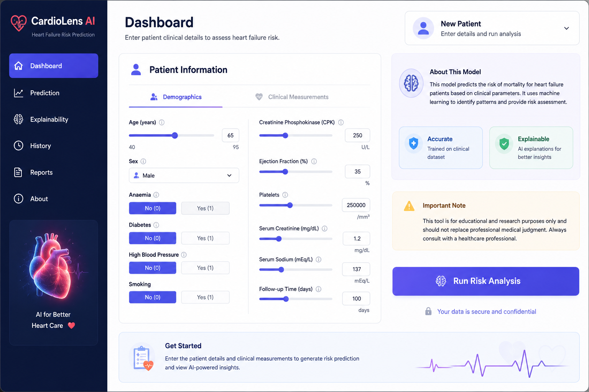
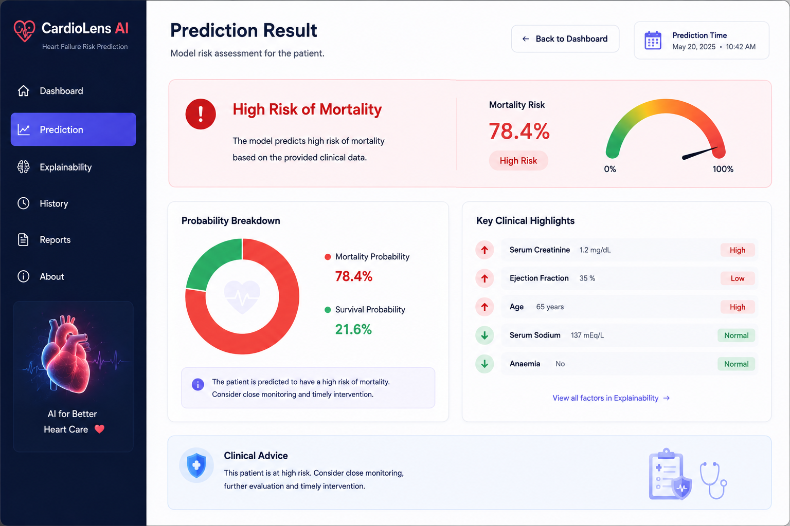
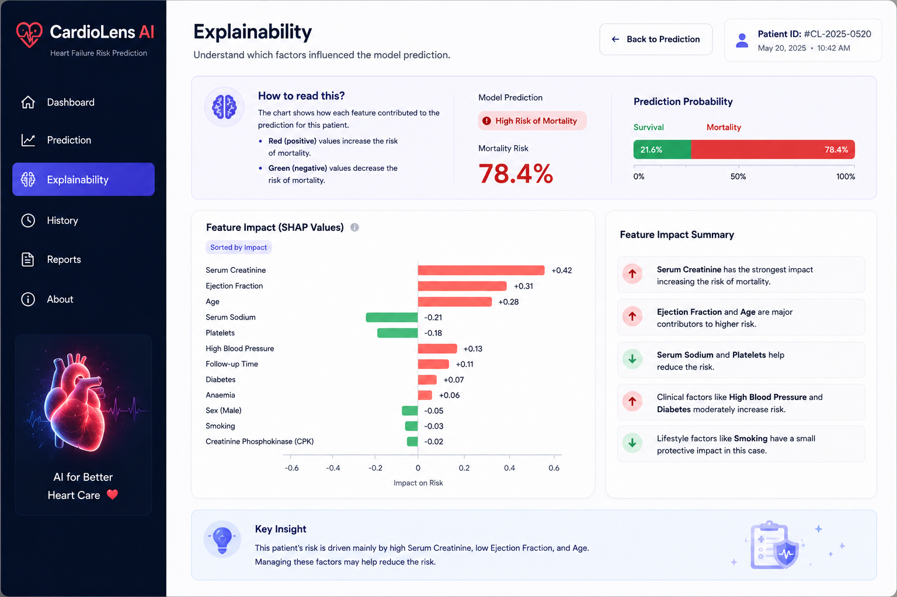

# 🫀 CardioLens AI  
### Explainable AI System for Heart Failure Risk Prediction

---

## ✨ Overview

CardioLens AI is a full-stack healthcare ML system that predicts heart failure mortality risk and explains predictions using interpretable feature attribution.

It combines:
- 🧠 Machine Learning (Random Forest)
- ⚡ FastAPI backend
- 🎨 Streamlit dashboard
- 📊 Explainable AI (SHAP-style feature impact)
- 🏥 Clinical-style UI

---

## 🖼️ Demo

> Add screenshots in `/assets`

| Dashboard | Prediction | Explainability |
|----------|------------|----------------|
|  |  |  |

---

## 🚀 Features

- ⚡ Real-time risk prediction  
- 🧠 Explainable AI (feature-level impact)  
- 📊 Probability visualization  
- 🏥 Clinical dashboard UI  
- 🔌 API-based ML inference  

---

## 🏗️ Architecture
Streamlit UI → FastAPI → ML Model → Explainability Layer → Visualization


---

## 📊 Dataset

Heart Failure Clinical Records Dataset (UCI / Kaggle)

Features:
- Age
- Anaemia
- Diabetes
- Ejection Fraction
- Serum Creatinine
- Serum Sodium
- Platelets
- Smoking
- Follow-up Time

---

## ⚙️ Setup

```bash
git clone https://github.com/your-username/cardiolens-ai.git
cd cardiolens-ai

python -m venv .venv
source .venv/bin/activate

pip install -r requirements.txt

mkdir -p data
curl -L -o data/heart_failure.csv https://raw.githubusercontent.com/plotly/datasets/master/heart_failure_clinical_records_dataset.csv

python -m ml.train
uvicorn api.main:app --reload
streamlit run app/main.py
```